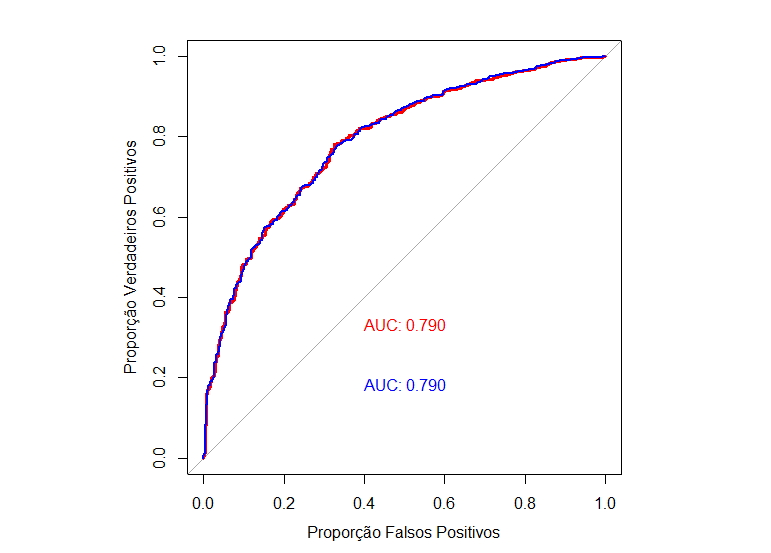
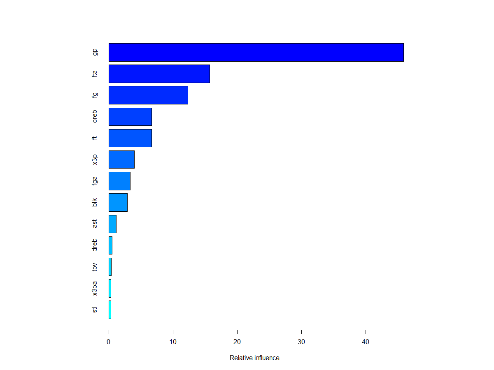
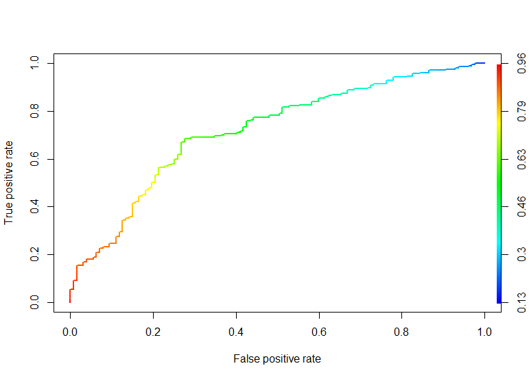

```{r include=FALSE}
library(dplyr);library(knitr);library(kableExtra)
```


# Objetivo

- O objetivo do trabalho é utilizar técnicas de aprendizado de máquina na base de dados fornecida sobre NBA para classificar possíveis promissores atletas.

# Variáveis
##
```{r echo=FALSE}
variaveis = c("Name","GP","MIN","PTS","FGM","FGA","FG%","3P MADE",
              "3PA","3P%","FTM","FTA","FT%","OREB","DREB","REB","AST",
              "SLT","BLK","TOV","TARGET_5Yrs")
descricao = c("Name","Games Played","Minutes Played","PointsPerGame","FieldGoalsMade",
              "FieldGoalsAttemps","FieldGoalPercent","3PointMade","3PointAttemps",
              "3PointesPercent","FreeThrowMade","FreeThrowAttempts","FreeThrowPercent",
              "OffensiveRebounds","DefensiveRebounds","Rebounds","Assists","Steals",
              "Blocks","Turnovers","Outcome: 1 if carrer length > 5yrs, 0 else")
tabela_var = tibble(Var_name=variaveis,
                    Description = descricao)
kable(tabela_var) %>% 
  kable_styling(font_size = 12, full_width = F)

```
##
- <font size="6">Em geral, a base de dados possui informações sobre jovens atletas que conseguiram chegar, ou não, a 5 anos jogados na NBA. O empresário afirma que se o indivíduo jogou 5 anos na NBA, ele é talentoso.</font>
- <font size="6">A base de dados fornecida apresenta 1350 observações e 21 variáveis, 19 são quantitativas enquanto 2 são qualitativas.</font>

# Metodologia
##

>- Foi gerado algumas medidas descritivas da base de dados, tais como: minimo, máximo, medidas de posição e quantidade de dados faltantes por variáveis. 
>- O modelo GBM (Gradient Boosting Machine) foi utilizado para realizar as classificações. Esse é um modelo que utiliza árvores de decisão para criação de um classificador ou regressor.

## Pré Processamento
##
>- Foi observado existência de dados faltantes, para isso foi utilizado o método de imputação KNN com k=5, assim, cada dado faltante será preenchido com a média de seus 5 vizinhos mais próximos.
>- Também foi verificado a existência de variáveis com variância 0 ou quase 0 (nzv), pois variáveis assim não acrescentam informação para modelagem. Nenhuma das variáveis analisadas foram classificadas como nzv.

##
>- Foram realizados cálculos para determinar as correlações entre as variáveis, as que obtiveram maior que 85% foram descartadas pois podem prejudicar a modelagem. Dentre todas as 21, foram excluídas 6, elas são: PTS, MIN, FGM, FTM, REB, X3P_MADE.
>- Também foi verificado a existência de dependência linear entre as variáveis, isso é, se uma variável é combinação linear de uma outra. Não foi encontrado dependência linear.

## Validação Cruzado
##
>- Com os dados tratados, foi realizado a modelagem de GBM com os seguinte hiperparâmetro:
>- Profundidade = 1,2,3,5,8
>- Número de árvores = 500,1000,1500,2500
>- Coeficiente de aprendizado = 0.01,0.02,0.03

## 
>- Para a realização de reamostragem, foram escolhidos os métodos de bootstrap com 10 reamotragens e kfold repetido com 10 reamostragens e 3 repetições. O objetivo é verificar qual é o melhor método.
>- O desempenho de cada modelo será analisado baseado no resultado do seu AUC.
>- Dentre os 120 modelos testados, aquele com melhor desempenho será escolhido para a realização da modelagem final.

# Resultados
## Tabela de medidas descritivas
```{r echo=FALSE}
load("objetos.Rdata")
kableExtra::kable_styling(knitr::kable(tabela),font_size = 12,full_width = F) %>% 
  scroll_box(width = "100%")
```

## Proporção de classificação
```{r echo=FALSE}
prop_resposta
```

## Modelagem por Bootstrap
```{r echo=FALSE}
tabela_boot %>% 
  kable() %>% 
  kable_styling(font_size = 12,full_width = F) %>% 
  scroll_box(width = "100%",
             height = "300px")
```

## Modelagem por repeatedcv
```{r echo=FALSE}
tabela_cv %>% 
  kable() %>% 
  kable_styling(font_size = 12,full_width = F) %>% 
  scroll_box(width = "100%",
             height = "300px")
```

## ROC dos 2 melhores modelos


<font size="3">Azul: Bootstrap (0.7902)</font>
<font size="3">Vermelho: repeatedcv (0.7904) </font>

## Tempo de processamento

```{r echo=FALSE}
graf_tempo
```


# Modelo escolhido
## 

- O modelo que teve a melhor performance foi o de coeficiente de aprendizado 0.01,
profundidade 1 e número de árvores 1000, com reamostragem por kfold repetido.
- Foi realizada a separação conforme a exigência de 25% para amostra teste e 75% para amostra treino. A modelagem a partir da amostra treino obteve o seguinte resultado:

```{r echo = FALSE}
modelo$results %>% 
  kable() %>% 
  kable_styling(font_size = 12,full_width = F) %>% 
  scroll_box(width = "100%")
```

##
- Variáveis mais influentes

```{r echo =FALSE}

tibble(Var = c("gp","fta","fg","oreb","ft","x3p","fga","blk","ast","dreb","tov","x3pa","stl") ,
      Influence =  c(45.9172748,15.6987368,12.2980805,6.6680500,6.6427327,
                     3.9906534,3.3055565,2.8876777,1.1636744,0.4858196,0.3420671,0.3033329,0.2963437)) %>% 
    kable() 
```

##


##
- Aplicando a modelagem na amostra teste, é adquirido um vetor de probabilidades, então assim é necessário adotar um ponto de corte para a classificação. 
- Foi utilizado uma função otimizadora que a partir dos dados da predição retorna o melhor ponto de corte, que no caso foi de 0.6033771.

## Curva ROC


# Resultado Para amostra teste
##

- Aplicando a modelagem na amostra teste e definindo o ponto de corte, são obtidos os seguintes resultados: 

```{r echo = FALSE}
x =
  data.frame(Acurácia = 0.7006,
             Sensibilidade = 0.7244,
             Especificidade = 0.6860,
             AUC = 0.7178) %>% 
  kable() 


x %>% 
  kable_styling(font_size = 15)
```

# Conclusão
##

>- Das modelagens feitas, as que mais se destacaram foram aquelas realizadas por kfold repetido.
>- Apesar do método kfold ser mais demorado, ele foi escolhido por possuir maiores AUCS em várias modelagens comparados aos de bootstrap.
>- O modelo final apresentou Acurácia em torno de 70%, isso significa que o modelo possui uma boa taxa de acerto.
>- O modelo apresentou Sensibilidade um pouco maior que a Especificidade, isso mostra que ele acerta mais os verdadeiros positivos do que os verdadeiros negativos.
